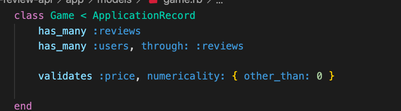
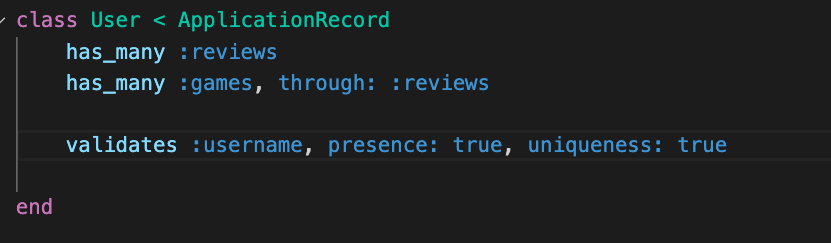
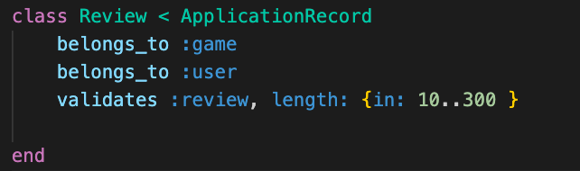
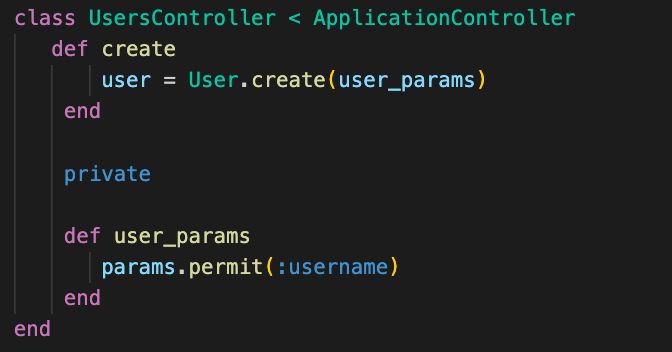
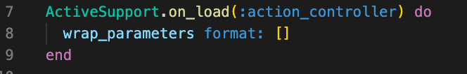
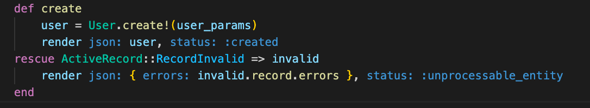
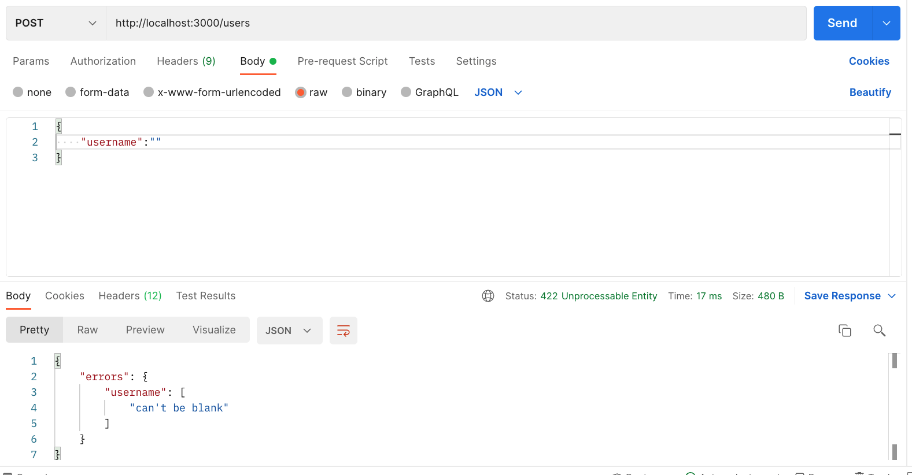

# Deliverables
Create a rails app 

>Note: if you get stuck review Active Record Validations and Controller Validations 

You've been hired to create a Game Review app. It will have a React client and Rails api. 

1. Add some validations to your models. Game price should be above 0, User username should be unique and present, review should be between 10 to 300 words. 
 

      

        solution 
      

      

         
      

       
      

       
      

      

 

2. Test that your validations work in the console. Once confirmed moved to one of your controllers and create strong params. Remove the nested params by formatting wrapped params in `config/initializers/wrap_parameters.rb`

 

      

        solution 
      

      

      
        
      

 

3. Handel the failed validation errors in your controller.

 

      

        solution 
      

      

      
      

 

 4. Test your validations with postman. 
 >Note: you might get a 404 not found error, where do you think this error is coming from? How do you fix it?
 
 

      

        solution 
      

      

      
      

 

 Bonus
 5. Repeat 2 - 4 for every controller and validation